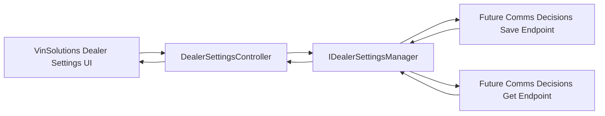
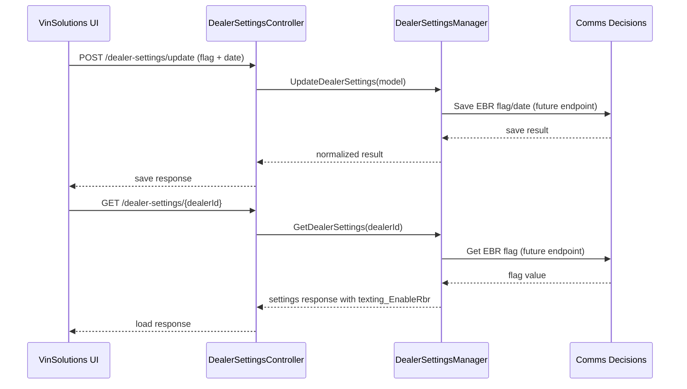

# EBR Setting Vin Texting API Architecture

## 1. Purpose

Define architecture for US1904827 with API-only scope where:
- UI sends EBR flag/date,
- Vin Api Texting forwards values to future Comms Decisions save endpoint,
- Vin Api Texting reads EBR flag from future Comms Decisions get endpoint.

Primary API entry point is `DealerSettingsController`.

## 2. Scope

In scope:
- Reuse existing `DealerSettingsController` endpoints:
  - `POST /dealer-settings/update` for save scenario.
  - `GET /dealer-settings/{dealerId}` for load scenario.
- Extend existing payload models to include:
  - `texting_EnableRbr`
  - `texting_EbrEstablishedDate`
- Add manager-level integration to future Comms Decisions save/get endpoints.
- Maintain existing auth, validation, and error-handling behavior.

Out of scope:
- UI component implementation.
- New Vin Api Texting endpoints.
- Final external Comms Decisions route definitions.

## 3. High-Level Architecture



## 4. Controller Mapping

Controller:
- `DealerSettingsController`
- Route base: `dealer-settings`

Save operation:
- Action: `UpdateDealerSettings`
- Route: `POST dealer-settings/update`
- Input model: `DealerSettingRequest` (extended with EBR fields)

Load operation:
- Action: `GetDealerSettings`
- Route: `GET dealer-settings/{dealerId}`
- Output model: existing dealer settings response model (extended to include EBR flag)

## 5. Data Contract Additions

Save payload additions from UI:

```json
{
  "texting_EnableRbr": true,
  "texting_EbrEstablishedDate": "2026-04-16T10:30:00Z"
}
```

Load payload addition to UI:

```json
{
  "texting_EnableRbr": true
}
```

Date policy:
- `texting_EbrEstablishedDate` must be UTC ISO-8601 when sent by UI.

## 6. Runtime Sequence



## 7. Logical Responsibilities

UI:
- Sends flag/date on save.
- Reads flag on load.

DealerSettingsController:
- Authentication and authorization checks.
- Request validation routing to manager.
- HTTP response mapping.

DealerSettingsManager:
- EBR field validation.
- External endpoint invocation.
- Mapping external payload to internal DTOs.

Comms Decisions (future):
- Save EBR flag/date.
- Return EBR flag on get.

## 8. Error Handling

Save path:
- Validation failure -> `400`.
- Auth failure -> `401`.
- Downstream failure -> `500` mapped with controlled message.

Load path:
- Auth failure -> `401`.
- Downstream failure -> `500` mapped with controlled message.

## 9. Security and Observability

Security:
- Reuse existing controller auth flow (`AuthenticateDealerIdForUser`).
- Keep least-data-forwarding to external endpoint.

Observability:
- Log `dealerId`, `texting_EnableRbr`, `texting_EbrEstablishedDate`, `correlationId`, `operation`, `result`.
- Track save/get success and failure metrics.

## 10. Risks and Mitigations

Risk: External endpoint contract changes.
- Mitigation: isolate mapping logic in manager adapter.

Risk: Endpoint not delivered on time.
- Mitigation: gate integration with configuration/feature flag.

Risk: Save/load semantic mismatch.
- Mitigation: contract tests for both paths before release.

## 11. Final Architecture Decision Summary

- `DealerSettingsController` is the API entry point for both save and load.
- Existing routes are reused; no new Vin Api Texting endpoint is introduced.
- Save path forwards UI-provided EBR flag/date to future Comms Decisions save endpoint.
- Load path retrieves EBR flag from future Comms Decisions get endpoint.
- Story remains API-only and aligned to US1904827 current approach.
