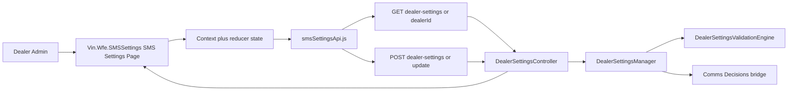
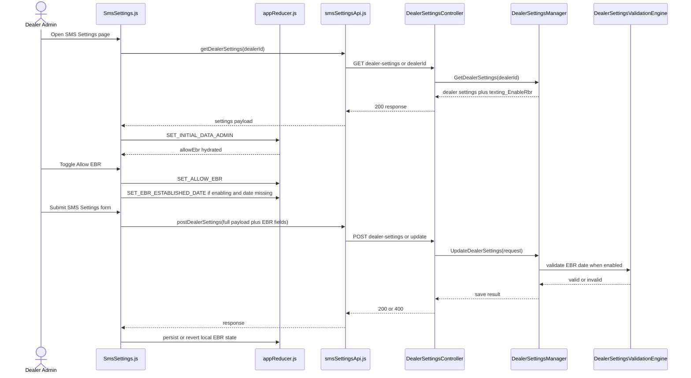

# EBR SMS Settings UI Architecture

## 1. Purpose

This document defines how to implement `US1904825` (EBR Setting - UI Flag Display on Dealer SMS Settings Page) using the backend API already delivered in `US1904827`.

Primary architectural decision:
- Reuse the existing Vin Api Texting dealer settings endpoints.
- Do not add a new UI-specific EBR endpoint.
- Implement EBR as one more setting within the existing SMS Settings page state, reducer, and submit flow.

This architecture is grounded in the current code, not a hypothetical API.

## 2. Dependency Context

Completed upstream story:
- `US1904827` implemented the API bridge in `Vin.Api.Texting`.

Available backend contract today:
- `GET /dealer-settings/{dealerId}`
- `POST /dealer-settings/update/`
- Request field: `texting_EnableRbr`
- Request field: `texting_EbrEstablishedDate`
- Response field: `texting_EnableRbr`

Important backend validation rule already in production code:
- If `texting_EnableRbr == true`, then `texting_EbrEstablishedDate` must be present on save.

Important backend limitation today:
- Load path currently returns the EBR flag, but not a reliable EBR established date from Comms Decisions.

That limitation materially affects UI save strategy and is called out explicitly in this document.

## 3. Implementation Goal

Add an `Allow EBR` checkbox to the existing SMS Settings page in `Vin.Wfe.SMSSettings` so that:
- the checkbox loads from the current dealer settings API,
- the checkbox saves through the existing SMS Settings submit flow,
- existing SMS settings fields continue to work unchanged,
- UI behavior remains aligned with current page architecture and admin authorization model.

## 4. Concrete Code Anchors

### 4.1 Frontend Repository

UI owner repository:
- `Vin.Wfe.SMSSettings`

### 4.2 Primary Files to Modify

UI page:
- `Vin.Wfe.SMSSettings/src/components/SmsSettings/SmsSettings.js`

Reducer:
- `Vin.Wfe.SMSSettings/src/components/appReducer.js`

Action enum:
- `Vin.Wfe.SMSSettings/src/components/actionEnum.js`

API client:
- `Vin.Wfe.SMSSettings/src/api/smsSettingsApi.js`

Checkbox pattern to reuse:
- `Vin.Wfe.SMSSettings/src/components/Checkbox/Checkbox.js`

Completed backend API anchors:
- `Vin.Api.Texting/Controllers/V1/DealerSettingsController.cs`
- `Vin.Api.Texting/Managers/DealerSettings/DealerSettingsManager.cs`
- `Vin.Api.Texting/Engines/Validation/DealerSettingsValidationEngine.cs`

## 5. Current Runtime Baseline

### 5.1 Current Load Flow in UI

`SmsSettings.js` already:
- reads dealer settings by calling `getDealerSettings(dealerId)`,
- dispatches `SET_INITIAL_DATA_ADMIN`,
- hydrates reducer state from `settings.data`.

### 5.2 Current Save Flow in UI

`SmsSettings.js` already:
- collects page state into `updateSettingsRequest`,
- posts the full payload through `postDealerSettings(updateSettingsRequest)`,
- uses one submit action for the entire SMS settings form.

### 5.3 Current Backend Behavior

`Vin.Api.Texting` already:
- accepts `texting_EnableRbr` and `texting_EbrEstablishedDate` on save,
- validates that date is present when EBR is enabled,
- returns `texting_EnableRbr` on load,
- defaults the flag to `false` when downstream EBR lookup is null or fails.

## 6. Architecture Decision

### Decision

Implement `Allow EBR` as an extension of the existing SMS Settings form, not as a separate widget with its own request lifecycle.

### Why

This is the lowest-risk path because it:
- preserves the existing `SmsSettings.js` form architecture,
- reuses current reducer and dispatch patterns,
- uses the backend contract already shipped in `US1904827`,
- avoids adding a second save endpoint or parallel state store.

## 7. High-Level Architecture



Architectural ownership:
- `Vin.Wfe.SMSSettings` owns rendering, local form state, and user feedback.
- `Vin.Api.Texting` remains the authoritative write and read API.
- `DealerSettingsManager` remains the orchestration layer for EBR save/get behavior.

## 8. Detailed Component Design

### 8.1 UI Component Placement

Add the checkbox to the existing checkbox group in:
- `Vin.Wfe.SMSSettings/src/components/SmsSettings/SmsSettings.js`

Placement should follow the same pattern as:
- manual opt-in,
- preemptive opt-in,
- preemptive include first message.

Recommended placement:
- below existing opt-in behavior checkboxes,
- inside the same admin-only section controlled by `hideNonAdminCSS`.

### 8.2 New Reducer State

Add these fields to `initialState` in `appReducer.js`:

```javascript
allowEbr: false,
ebrEstablishedDateUtc: null,
lastPersistedAllowEbr: false,
lastPersistedEbrEstablishedDateUtc: null,
ebrSaveError: null
```

Rationale:
- `allowEbr` drives the checkbox UI.
- `ebrEstablishedDateUtc` tracks the outbound date needed by the backend save contract.
- `lastPersisted*` supports revert-on-failure behavior.
- `ebrSaveError` supports inline or toast feedback.

### 8.3 New Actions

Add actions to `actionEnum.js`:

```javascript
SET_ALLOW_EBR: "SET_ALLOW_EBR",
SET_EBR_ESTABLISHED_DATE: "SET_EBR_ESTABLISHED_DATE",
SET_EBR_PERSISTED_STATE: "SET_EBR_PERSISTED_STATE",
SET_EBR_SAVE_ERROR: "SET_EBR_SAVE_ERROR",
CLEAR_EBR_SAVE_ERROR: "CLEAR_EBR_SAVE_ERROR"
```

### 8.4 Reducer Mapping

Update `SET_INITIAL_DATA_ADMIN` to map:

```javascript
allowEbr: payload.data.texting_EnableRbr ?? false,
ebrEstablishedDateUtc: payload.data.texting_EbrEstablishedDate ?? null,
lastPersistedAllowEbr: payload.data.texting_EnableRbr ?? false,
lastPersistedEbrEstablishedDateUtc: payload.data.texting_EbrEstablishedDate ?? null
```

Note:
- the DTO supports `texting_EbrEstablishedDate`,
- but the current backend load path does not reliably populate it from the EBR bridge,
- so this state can initialize to `null` even when `allowEbr === true`.

## 9. API Contract to Use

### 9.1 Load Contract

Use the existing API client in:
- `Vin.Wfe.SMSSettings/src/api/smsSettingsApi.js`

Existing call:

```javascript
getDealerSettings(dealerId)
// GET /dealer-settings/{dealerId}
```

Expected fields relevant to this story:

```json
{
  "dealerId": 8259,
  "texting_EnableRbr": true,
  "texting_EbrEstablishedDate": null
}
```

Important reality:
- the UI can depend on `texting_EnableRbr`,
- the UI cannot yet depend on `texting_EbrEstablishedDate` being present for existing enabled dealers.

### 9.2 Save Contract

Use the existing call:

```javascript
postDealerSettings(updateSettingsRequest)
// POST /dealer-settings/update/
```

Required outbound fields:

```json
{
  "dealerId": 8259,
  "texting_EnableRbr": true,
  "texting_EbrEstablishedDate": "2026-04-21T12:30:00.000Z"
}
```

Backend validation rule:
- if `texting_EnableRbr` is `true`, `texting_EbrEstablishedDate` must not be null.

## 10. Save Strategy for the Checkbox

### 10.1 Decision Rule

The checkbox cannot simply post a boolean. It must also maintain a valid `texting_EbrEstablishedDate` whenever the saved value is `true`.

### 10.2 UI Save Rules

Rule 1: User enables EBR from false to true.
- Set `allowEbr = true`.
- Set `ebrEstablishedDateUtc = new Date().toISOString()` if no date is already present.
- Include both fields in `updateSettingsRequest`.

Rule 2: User keeps EBR enabled and changes other SMS settings.
- Reuse the existing `ebrEstablishedDateUtc` in state.
- Do not generate a new timestamp if one is already present.

Rule 3: User disables EBR.
- Set `allowEbr = false`.
- Send `texting_EnableRbr = false`.
- Send `texting_EbrEstablishedDate = null`.

### 10.3 Current API Gap

There is one unresolved case with the current backend contract:

Scenario:
- dealer already has EBR enabled in backend,
- UI load returns `texting_EnableRbr = true`,
- UI does not receive a reliable existing established date,
- user later saves the SMS Settings page.

Impact:
- the UI may not have a valid date to resend,
- backend validation can reject the save,
- or the UI may generate a new date and overwrite historical meaning.

### 10.4 Recommended Resolution Before UI Story Close

One of these backend alignment decisions is required:

Option A, preferred:
- extend `GET /dealer-settings/{dealerId}` so `texting_EbrEstablishedDate` is reliably returned.

Option B:
- relax validation so date is required only when transitioning from disabled to enabled.

Option C, least preferred:
- UI generates a new UTC timestamp whenever loaded state is enabled but date is missing.

Recommendation:
- choose Option A.

Reason:
- it preserves semantics,
- keeps UI deterministic,
- avoids silently mutating established-date meaning on unrelated edits.

## 11. End-to-End Runtime Sequence



## 12. LaunchDarkly Gating

### 12.1 Flag Convention

The new control must be gated by a new LaunchDarkly flag that follows the existing CXM naming convention already used elsewhere in the workspace:
- `nx.cxm.show-*` for visibility-driven UI flags
- flags consumed through `useCxmFlags()`
- flags registered in the shared toggle registry

Existing examples in the workspace:
- `nx.cxm.show-data-purge-tab`
- `nx.cxm.show-data-purge-message`
- `nx.cxm.show-user-management`
- `nx.cxm.show-vin-employee-management`

Recommended new flag name:
- `nx.cxm.show-sms-settings-ebr-control`

Reason:
- keeps the `nx.cxm` namespace,
- uses the existing `show-*` visibility convention,
- makes the scope explicit: SMS Settings plus EBR control,
- avoids overloading an edit-permission flag such as `nx.cxm.edit-dealer-settings`.

### 12.2 Registry Pattern

If the control is surfaced through CXM LaunchDarkly infrastructure, add the flag to the shared toggle registry in the same style as existing flags:
- `ui-mono-repo/libs/core/third-party/launch-darkly/src/lib/toggles.ts`

Expected registration pattern:

```ts
{
  /** nx.cxm.show-sms-settings-ebr-control
   * Show Allow EBR control in SMS Settings */
  name: "nx.cxm.show-sms-settings-ebr-control",
  apps: ["cxm"]
}
```

### 12.3 Consumption Pattern

The existing CXM convention is to consume flags through:
- `useCxmFlags()`

Expected usage pattern:

```ts
const { "nx.cxm.show-sms-settings-ebr-control": showEbrControl } = useCxmFlags();
```

Then gate rendering with:

```ts
{showEbrControl === true && <AllowEbrControl />}
```

### 12.4 Integration Decision for This Story

There is a platform distinction to account for:
- existing LaunchDarkly conventions are implemented in `ui-mono-repo`,
- the SMS Settings UI currently lives in `Vin.Wfe.SMSSettings`,
- `Vin.Wfe.SMSSettings` does not currently show direct LaunchDarkly integration in this workspace.

Architectural decision:
- the new control must still be governed by the new LaunchDarkly flag,
- but implementation must introduce or receive a resolved flag value in a way that matches the host platform.

Preferred order:
1. If the SMS Settings page is rendered inside a CXM host already using the shared LaunchDarkly provider, consume `useCxmFlags()` directly and gate the control in-page.
2. If `Vin.Wfe.SMSSettings` remains standalone, add a thin host-to-app configuration seam so the resolved LaunchDarkly value is passed into the page bootstrap or launch parameters.
3. Do not hardcode fallback visibility to ON.

### 12.5 Default and Rollout Rule

The new flag must default to OFF.

Behavior:
- Flag OFF: `Allow EBR` control is not rendered.
- Flag ON: `Allow EBR` control is rendered for authorized admin users.

This keeps rollout safe while backend/UI contract alignment around `texting_EbrEstablishedDate` is finalized.

## 13. UI Rendering Design

### 13.1 Checkbox Label

Recommended label:
- `Allow EBR`

Recommended help text:
- `Allows Existing Business Relationship logic to be applied when evaluating SMS communication decisions for this dealership.`

### 13.2 Rendering Rules

- Render the control only when the new LaunchDarkly flag is `true`.
- Render the control only for admin-capable users, consistent with the rest of the editable SMS settings section.
- Render using the existing reusable checkbox component.
- Keep visual layout consistent with the current checkbox stack.
- When the flag is OFF, the page must behave exactly as it does today.

### 13.3 Accessibility Requirements

- Checkbox must remain reachable by keyboard tab order.
- Label must be human-readable and concise.
- If help text is separate from label, associate it with the control.
- Save errors must be perceivable without relying only on color.

## 14. Error Handling

### 14.1 Load Errors

If `getDealerSettings` fails:
- preserve current page behavior,
- do not render EBR in an indeterminate checked state,
- surface the same unauthorized or load-failure behavior already used by the page.

### 14.2 Save Errors

If `postDealerSettings` fails:
- revert `allowEbr` to `lastPersistedAllowEbr`,
- revert `ebrEstablishedDateUtc` to `lastPersistedEbrEstablishedDateUtc`,
- show inline or toast error feedback,
- keep other unsaved text settings untouched where possible.

### 14.3 Validation Failure

If backend returns `400` due to missing EBR date:
- surface a targeted error indicating EBR could not be saved,
- log the failure in UI telemetry if available,
- do not silently swallow the validation error.

## 15. Performance and Observability

Performance:
- No extra load API call is required because `getDealerSettings` already exists.
- No extra save API call is required because the page already posts the complete settings payload.
- Reducer changes are constant-time and local.
- Additional runtime overhead is negligible compared with existing page load and submit behavior.
- Flag evaluation should reuse the existing LaunchDarkly provider path where available, not introduce a second provider instance per page render.

Observability:
- Track flag-off versus flag-on behavior in UI telemetry if the host platform supports it.
- Log save failures with enough context to distinguish:
  - flag hidden path,
  - flag visible plus load success path,
  - flag visible plus validation failure path.

## 16. Security and Authorization

- Reuse current JWT-backed SMS Settings access model in the UI.
- Reuse backend `AuthenticateDealerIdForUser` authorization in `DealerSettingsController`.
- Do not add any client-side-only authorization assumptions.
- LaunchDarkly is not the authorization layer.
- Treat the backend as the source of truth for whether updates are allowed.

## 17. Test Strategy

### 17.1 Frontend Unit Tests

Add or update tests to verify:
- checkbox does not render when `nx.cxm.show-sms-settings-ebr-control` is false,
- checkbox renders with loaded EBR value when the flag is true,
- toggle dispatches `SET_ALLOW_EBR`,
- enabling EBR sets an established date when missing,
- disabling EBR clears the date,
- submit payload includes both `texting_EnableRbr` and `texting_EbrEstablishedDate`.

### 17.2 Frontend Integration Tests

Verify:
- `getDealerSettings` hydrates checkbox state,
- `postDealerSettings` receives correct EBR fields,
- failed save reverts local checkbox state,
- unrelated SMS settings continue saving correctly with EBR present,
- flag OFF leaves existing page behavior unchanged.

### 17.3 Backend Contract Checks

Before UI release, verify against QA:
- enabled save with valid timestamp returns `200`,
- disabled save returns `200`,
- enabled save without timestamp returns `400`,
- load response contains the expected `texting_EnableRbr` behavior.

## 18. Implementation Steps

1. Introduce the new LaunchDarkly flag using the existing CXM naming convention: `nx.cxm.show-sms-settings-ebr-control`.
2. Register the flag in the shared toggle registry if the page is using CXM LaunchDarkly infrastructure.
3. Add a flag-consumption seam to `Vin.Wfe.SMSSettings` so the control can be conditionally rendered.
4. Add reducer state and action constants for EBR.
5. Map `texting_EnableRbr` and `texting_EbrEstablishedDate` during `SET_INITIAL_DATA_ADMIN`.
6. Add `Allow EBR` checkbox to `SmsSettings.js` in the admin-only checkbox section.
7. Extend `onChangeCheckBoxes` to handle EBR toggling.
8. Extend `updateSettingsRequest` to include `texting_EnableRbr` and `texting_EbrEstablishedDate`.
9. Add revert-on-failure logic for EBR state around save failures.
10. Add tests for both flag states, load, toggle, save, and backward compatibility.
11. Confirm backend decision on established-date load semantics before closing the story.

## 19. Deployment and Rollout

Rollout strategy:
1. Keep the new LaunchDarkly flag OFF by default.
2. Deploy any backend alignment needed for reliable `texting_EbrEstablishedDate` load behavior.
3. Deploy UI code with the control hidden behind `nx.cxm.show-sms-settings-ebr-control`.
4. Enable in QA/UAT for targeted validation.
5. Progressively enable in production after contract and telemetry validation.

Rollback:
- Turning the flag OFF hides the new control immediately.
- Existing SMS Settings behavior remains unchanged.
- Backend remains backward-compatible for clients not sending EBR fields.

## 20. Final Architecture Decision Summary

- The UI story should be implemented in `Vin.Wfe.SMSSettings`, not by adding a new service or endpoint.
- The new control must be gated by a LaunchDarkly flag that follows the existing CXM naming convention.
- The recommended flag name is `nx.cxm.show-sms-settings-ebr-control`.
- The existing `dealer-settings` GET and POST endpoints from `US1904827` are the authoritative integration path.
- `Allow EBR` must be modeled as part of the existing SMS settings reducer and form submit payload.
- `texting_EbrEstablishedDate` is a required backend save dependency and must be tracked in UI state.
- A small backend alignment is still recommended so the load path can return a reliable EBR established date for already-enabled dealers.
- With the flag OFF, page behavior remains exactly as it is today.