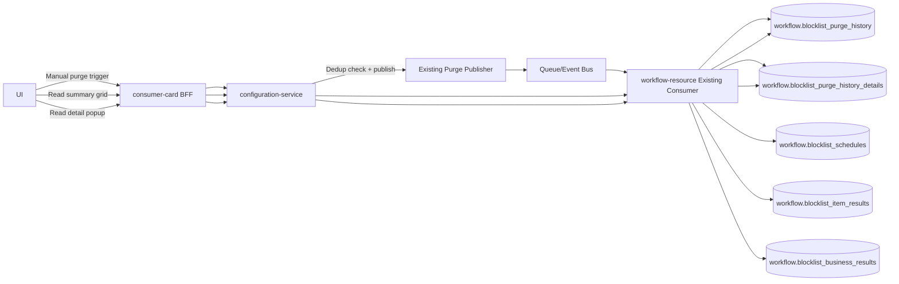
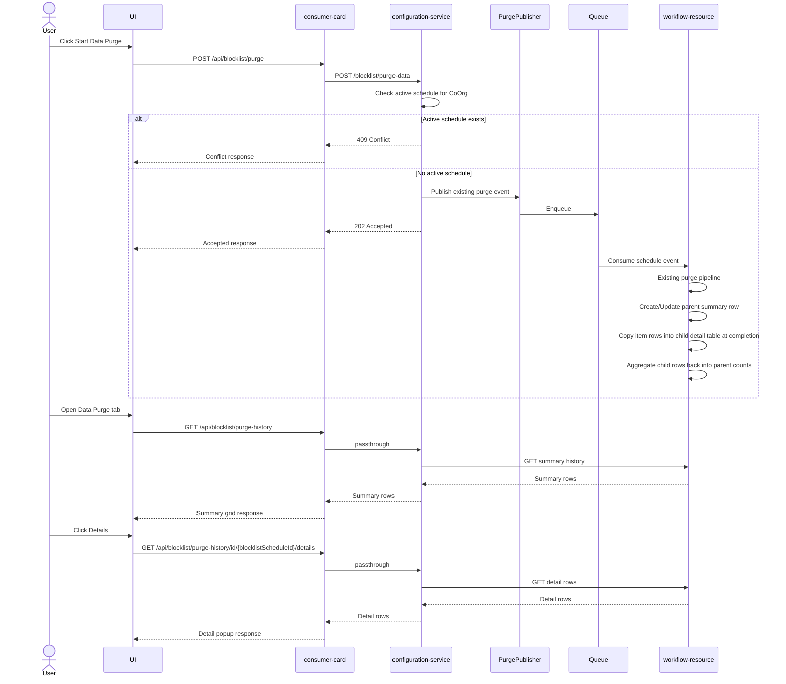

# Data Purge Endpoint

## Objective

Add API support so users can manually trigger blocklist data purge from the UI and read purge history through a normalized storage model, while preserving existing automatic purge behavior and keeping purge business logic unchanged.

The read side must support:
1. a lightweight summary history endpoint for the Data Purge grid, and
2. a record-level detail endpoint for drilldown popup screens.

---

## Non-Negotiable Constraints

- No change to the existing purge business logic.
- Existing auto-trigger path from add-rule must continue to work as-is.
- Existing dedup behavior, one active schedule per CoOrg, must be preserved.
- Existing workflow-resource purge execution path is reused.
- History persistence is additive and must not block the main purge flow if it fails.

---

## Current Flow (Auto Trigger)

1. UI calls add-rule endpoint.
2. consumer-card forwards to configuration-service.
3. configuration-service creates or validates the rule.
4. If `ScheduleDataPurge` is true, configuration-service checks for an active schedule for the CoOrg.
5. If no active schedule exists, configuration-service publishes the purge event.
6. Existing workflow-resource consumers execute the current rule-driven purge pipeline.

---

## Target Flow (Auto + Manual + History)

- Auto trigger remains unchanged.
- New manual trigger endpoint is exposed for UI usage.
- Both auto and manual paths reuse the same dedup and publish behavior.
- workflow-resource persists run summary into `workflow.blocklist_purge_history`.
- workflow-resource persists record-level drilldown rows into `workflow.blocklist_purge_history_details`.
- UI summary grid reads only from the summary endpoint.
- UI details popup reads only from the detail endpoint.

---

## Architecture Diagram

---

## Sequence Diagram

---

## Storage Model

### Parent Summary Table

`workflow.blocklist_purge_history`

Stores one row per purge run:
- schedule identity
- org identity
- status
- started/completed timestamps
- duration
- summary counts by type
- business result count
- failure count
- optional retention metrics

### Child Detail Table

`workflow.blocklist_purge_history_details`

Stores one row per processed source item:
- parent history row ID
- schedule ID
- CoOrg ID
- `record_type`
- `common_consumer_id`
- `record_value`
- `item_status`
- `result_payload`
- page metadata

### Why This Split Exists

The old model put detail data inline on the parent row. That would make the summary endpoint heavy and slow for large runs. The normalized design keeps:

- summary endpoint fast
- drilldown endpoint paged and index-backed
- detail storage queryable without deserializing large blobs

---

## API Design

Comprehensive endpoint schemas live in [data purge api endpoints.md](/c:/Code/_bmad-output/planning-artifacts/data purge api endpoints.md).

This section records the architectural intent only.

### Configuration-Service Internal Endpoint

- `POST /blocklist/purge-data`
- Purpose: manual trigger for current org
- Response: `202 Accepted` or `409 Conflict`

### Consumer-Card / BFF Endpoints

1. `POST /api/blocklist/purge`
   - manual trigger

2. `GET /api/blocklist/purge-history`
   - summary list endpoint
   - backed by `workflow.blocklist_purge_history`

3. `GET /api/blocklist/purge-history/id/{blocklistScheduleId}/details`
   - detail drilldown endpoint
   - backed by `workflow.blocklist_purge_history_details`

---

## Read/Write Responsibilities by Service

### configuration-service
- expose internal manual trigger endpoint
- keep current dedup + publish behavior
- optionally add passthroughs for summary and detail history reads

### consumer-card BFF
- expose UI-facing manual trigger endpoint
- expose summary history endpoint
- expose detail drilldown endpoint
- map auth/org context to downstream contracts

### workflow-resource
- own history persistence
- own summary query endpoint
- own detail query endpoint
- write parent summary row during lifecycle transitions
- insert child detail rows at completion before cleanup removes source rows

---

## Updated Implementation Plan

### Phase 1
1. Manual trigger endpoint in configuration-service.
2. Keep auto-trigger behavior unchanged.

### Phase 2
1. Create `workflow.blocklist_purge_history` migration.
2. Create `workflow.blocklist_purge_history_details` migration.
3. Add workflow-resource repository/resource-access for parent summary row.
4. Add workflow-resource repository/resource-access for child detail rows.
5. Insert child detail rows from `workflow.blocklist_item_results` at schedule completion.
6. Aggregate child detail rows into parent summary counts.

### Phase 3
1. Add workflow-resource summary history endpoint.
2. Add workflow-resource detail drilldown endpoint.
3. Add configuration-service passthroughs if needed.
4. Add consumer-card BFF summary/detail endpoints.
5. Align UI Data Purge tab to summary grid + detail modal request flow.

---

## UI Requirements Alignment

1. Data Purge tab has one right-aligned `Start Data Purge` button.
2. Data Purge tab renders one summary grid below the button.
3. Grid columns are:
   - `Status`
   - `Start Date`
   - `End Date`
   - `Duration`
   - `Total Records Processed`
   - `Started By`
   - `Details`
4. Grid data is loaded from the summary endpoint whenever the tab becomes active.
5. Grid refreshes after successful manual trigger.
6. Clicking `Details` opens a popup/modal and makes a separate request to the detail endpoint.
7. Detail popup uses paged record-level rows instead of three embedded payload arrays.

---

## Impacted Files

### Existing implementation already added/planned at trigger layer
- `configuration-service/src/CoxAuto.Thunderbird.ConfigurationService.Core/Models/TriggerBlocklistPurgeRequest.cs`
- `configuration-service/src/CoxAuto.Thunderbird.ConfigurationService.Core/Models/TriggerBlocklistPurgeResponse.cs`
- `configuration-service/src/CoxAuto.Thunderbird.ConfigurationService.Core/Managers/IBlocklistManager.cs`
- `configuration-service/src/CoxAuto.Thunderbird.ConfigurationService.Core/Managers/BlocklistManager.cs`
- `configuration-service/src/CoxAuto.Thunderbird.ConfigurationService.Core/Orchestrators/BlockListController.cs`

### Planned next
- workflow-resource repository/resource-access for parent and child history tables
- workflow-resource summary and detail controllers/contracts
- consumer-card BFF summary and detail endpoints

---

## Acceptance Criteria

1. Manual purge can be triggered independently of add-rule flow.
2. Existing add-rule auto-trigger behavior remains unchanged.
3. Purge dedup behavior is preserved.
4. Existing workflow-resource purge logic is reused without business logic modification.
5. Purge execution persists one summary row per schedule in `workflow.blocklist_purge_history`.
6. Purge execution persists one detail row per processed item in `workflow.blocklist_purge_history_details`.
7. Parent summary counts are derived from child detail rows.
8. Data Purge tab reads lightweight history from the summary endpoint.
9. Details popup reads paged drilldown records from the detail endpoint.
10. No inline `detailsPayload` or embedded grouped arrays are required on summary rows.
11. Grid refreshes whenever the user enters the Data Purge tab.
12. Conflict and success responses are deterministic and testable.
